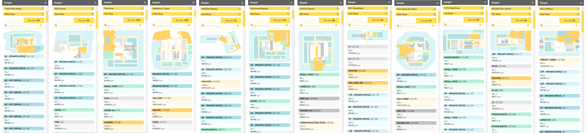
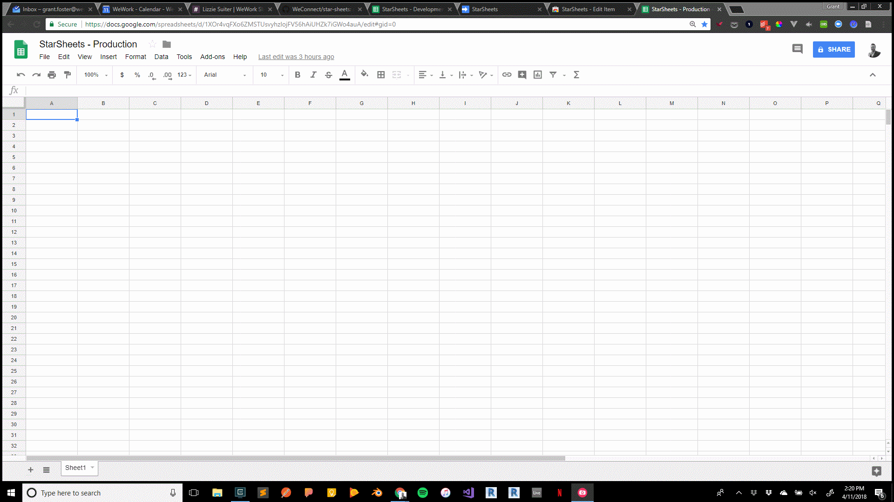

## Stack


## Code Snippets - [View on Github](https://github.com/WeConnect/star-sheets)

#### Create Vector Plan from Points
```html
<svg :width="windowWidth[1]" :height="windowHeight[0]">
  <path
    v-for="room, index in rooms"
    :key="room.uuid"
    @mouseover="hoveredRoom = room.uuid"
    @mouseleave="hoveredRoom = null"
    @click="addRoomToSelection(room)"
    :d="computeLine(room.outline)"
    :style="{'cursor': 'pointer', 'fill': getProgramColor(room, index, true)}">
  </path>
</svg>
```
```javascript
computeLine: function (points) {
  var line = d3.line().x(pt => this.scaleX()(pt.x)).y(pt => this.scaleY()(pt.y)).curve(d3.curveLinearClosed);
  return line(points);
},
scaleX () {
  return d3.scaleLinear().domain(this.planWidth).range(this.windowWidth)
},
scaleY () {
  return d3.scaleLinear().domain(this.planHeight).range(this.windowHeight)
}
```

#### Create a Google Sheet Tab with Data
```javascript
function createTabWithData(tabName, headers, doubleArray) {
  var tab = createTab(tabName);
  var rows = doubleArray.length;
  var columns = doubleArray[0].length;
  // row, column, rows, columns
  tab.getRange(1, 1, 1, columns).setValues([headers]);
  tab.getRange(2, 1, rows, columns).setValues(doubleArray);
  return tabName;
}
```